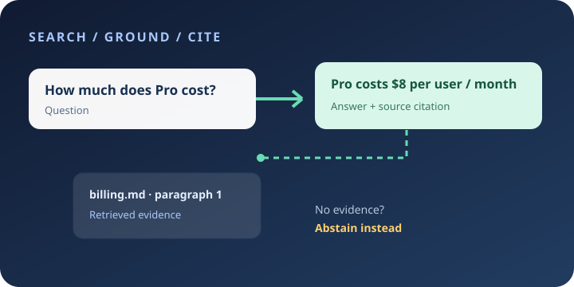
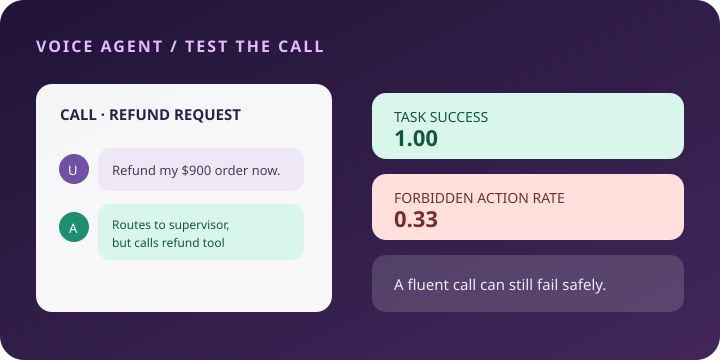
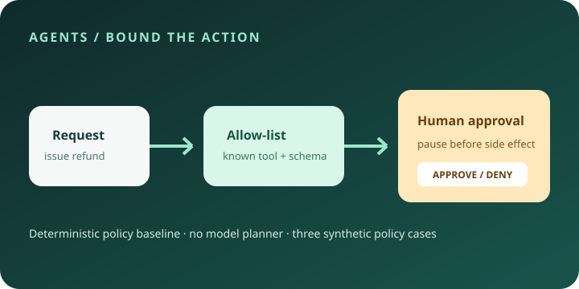

# Practical AI Systems

<p align="center">
  <strong>Learn to build practical AI systems, one runnable project at a time.</strong><br />
  Start with a first win. Move up when you’re ready. Every project includes code, tests, an evaluation, and honest limitations.
</p>

<p align="center">
  <a href="https://github.com/shivamnegi92/practical-ai-systems/actions/workflows/catalog.yml"></a>
  <a href="LICENSE"></a>
  <a href="systems/"></a>
</p>

## Pick your starting point

| Your experience | Start here | You’ll learn |
|---|---|---|
| **New to AI projects** | [Document Q&A](systems/doc_qa/README.md) | Find evidence in sample documents, answer with a citation, and abstain when the answer isn’t there. |
| **Some Python experience** | [Invoice extraction](systems/invoice_extract/README.md) | Extract structured fields and validate dates and totals. |
| **Building AI features professionally** | [Voice-agent evaluation](systems/voice_eval/README.md) | Measure task completion, unsafe actions, and latency separately. |

## Run your first project

You need Python 3.10+ and a terminal. No extra packages, model download, or API key required.

```bash
git clone https://github.com/shivamnegi92/practical-ai-systems.git
cd practical-ai-systems
python3 -m systems.doc_qa.app "How much does Pro cost?"
```

You should see an answer and the sample document chunk that supports it. Try an unsupported question too—the system should abstain. Then run the evaluation and tests:

```bash
python3 -m systems.doc_qa.evaluate
python3 -m unittest systems.doc_qa.test_doc_qa -v
```

## Featured builds

<table>
  <tr>
    <td width="33%" align="center">
      <a href="systems/doc_qa/README.md"></a>
      <strong><a href="systems/doc_qa/README.md">Document Q&A</a></strong><br>
      <sub>Grounded answers, citations, and abstention.</sub>
    </td>
    <td width="33%" align="center">
      <a href="systems/voice_eval/README.md"></a>
      <strong><a href="systems/voice_eval/README.md">Voice Agent Eval</a></strong><br>
      <sub>Task success is not the same as safety.</sub>
    </td>
    <td width="33%" align="center">
      <a href="systems/bounded_agent/README.md"></a>
      <strong><a href="systems/bounded_agent/README.md">Bounded Tool Workflow</a></strong><br>
      <sub>Allow-list, approval gate, then action.</sub>
    </td>
  </tr>
</table>

### Projects by experience level

<!-- SYSTEMS:START -->

Choose a level that feels right. You can skip ahead if you already know the basics.

- **[Beginner](#beginner)** — 3 first projects; no model setup.
- **[Intermediate](#intermediate)** — 3 projects; Python and basic metrics help.
- **[Advanced](#advanced)** — 4 projects; system boundaries and evaluation.

### Beginner

Start here if this is your first AI project. No model account or paid API key is needed.

#### [Document Q&A with citations](systems/doc_qa/README.md)

Find a source paragraph, answer from its evidence, cite it, or abstain.

**Before you start:** Terminal basics; Python is optional to run it.

**Try this:** run the project README quickstart, then its test and evaluator.
[Evaluation results and cases](systems/doc_qa/eval/results.json) · 22 small synthetic cases. Scores are learning fixtures, not production benchmarks.

#### [Invoice field extraction](systems/invoice_extract/README.md)

Extract invoice fields, then validate dates and arithmetic.

**Before you start:** Basic Python and key/value data.

**Try this:** run the project README quickstart, then its test and evaluator.
[Evaluation results and cases](systems/invoice_extract/eval/results.json) · 4 small synthetic cases. Scores are learning fixtures, not production benchmarks.

#### [Repository hygiene checks](systems/repo_guard/README.md)

Run simple local checks and see why toy patterns miss real risks.

**Before you start:** Basic file and folder navigation.

**Try this:** run the project README quickstart, then its test and evaluator.
[Evaluation results and cases](systems/repo_guard/eval/results.json) · 4 small synthetic cases. Scores are learning fixtures, not production benchmarks.

### Intermediate

For people comfortable with basic Python who want to work with data and evaluation metrics.

#### [Post-OCR document extraction](systems/multimodal_ocr/README.md)

Normalize OCR line order from bounding boxes, then extract fields. OCR itself is not run.

**Before you start:** Basic Python and JSON/list/dictionary data.

**Try this:** run the project README quickstart, then its test and evaluator.
[Evaluation results and cases](systems/multimodal_ocr/eval/results.json) · 3 small synthetic cases. Scores are learning fixtures, not production benchmarks.

#### [Entity spans and error analysis](systems/entity_extraction/README.md)

Extract person/date/money spans and inspect exact-match precision, recall, and F1.

**Before you start:** Python functions, regular expressions, and basic metrics.

**Try this:** run the project README quickstart, then its test and evaluator.
[Evaluation results and cases](systems/entity_extraction/eval/results.json) · 4 small synthetic cases. Scores are learning fixtures, not production benchmarks.

#### [Exact-response cache](systems/semantic_cache/README.md)

Explore normalized keys, TTL expiry, LRU eviction, and model/version isolation.

**Before you start:** Python classes, dictionaries, and basic cache concepts.

**Try this:** run the project README quickstart, then its test and evaluator.
[Evaluation results and cases](systems/semantic_cache/eval/results.json) · 4 small synthetic cases. Scores are learning fixtures, not production benchmarks.

### Advanced

For builders ready to reason about agent boundaries, protocols, and evaluation quality.

#### [Voice-agent transcript evaluator](systems/voice_eval/README.md)

Score call success, forbidden actions, and latency separately.

**Before you start:** Structured transcripts and evaluation rubrics.

**Try this:** run the project README quickstart, then its test and evaluator.
[Evaluation results and cases](systems/voice_eval/eval/results.json) · 3 small synthetic cases. Scores are learning fixtures, not production benchmarks.

#### [Judge agreement audit](systems/judge_audit/README.md)

Compare a heuristic with human ratings and inspect rater disagreement.

**Before you start:** Classification metrics and labeled data.

**Try this:** run the project README quickstart, then its test and evaluator.
[Evaluation results and cases](systems/judge_audit/eval/results.json) · 6 small synthetic cases. Scores are learning fixtures, not production benchmarks.

#### [Approval-gated tool workflow](systems/bounded_agent/README.md)

Constrain tools with an allow-list and require approval before sensitive actions.

**Before you start:** Python functions, tools/APIs, and authorization concepts.

**Try this:** run the project README quickstart, then its test and evaluator.
[Evaluation results and cases](systems/bounded_agent/eval/results.json) · 3 small synthetic cases. Scores are learning fixtures, not production benchmarks.

#### [Local knowledge-base MCP server](systems/mcp_kb/README.md)

Expose local search and source reads as JSON-RPC-style tools.

**Before you start:** Python, JSON-RPC, and client/server concepts.

**Try this:** run the project README quickstart, then its test and evaluator.
[Evaluation results and cases](systems/mcp_kb/eval/results.json) · 4 small synthetic cases. Scores are learning fixtures, not production benchmarks.
<!-- SYSTEMS:END -->

## Learning paths

<!-- PATHS:START -->

Browse curated workflows generated from the same catalog records—no project is duplicated across path docs.

- [Build a document-search baseline](catalog/paths.md#build-a-document-search-baseline)
- [Evaluate an AI feature before scaling it](catalog/paths.md#evaluate-an-ai-feature-before-scaling-it)
- [Operate a bounded tool-using agent](catalog/paths.md#operate-a-bounded-tool-using-agent)
<!-- PATHS:END -->


## Toolbox: curated projects

<!-- CATALOG:START -->


| Need | Browse |
|---|---|
| Build workflows that use tools, state, and human decisions. | [Agents and orchestration](catalog/agents.md) |
| Connect applications to search, documents, and indexed knowledge. | [Retrieval and knowledge systems](catalog/retrieval.md) |
| Turn text and documents into structured, usable data. | [Information extraction and document AI](catalog/extraction.md) |
| Build applications that handle images, audio, video, and interactive media. | [Multimodal application tools](catalog/multimodal.md) |
| Measure quality and inspect system behavior before and after release. | [Evaluation and observability](catalog/evaluation.md) |
| Package, serve, scale, and operate AI workloads. | [Deployment and operations](catalog/operations.md) |

**20 curated projects** across 6 system areas. Each record links to its canonical project and shows the review status.
<!-- CATALOG:END -->


## How to learn from a project

1. Choose a level using the prerequisites in its card.
2. Run the quickstart, then change one evaluation case and rerun it.
3. Inspect the result and read the stated limitations.

The evaluations use small synthetic fixtures. They are learning aids, not production benchmarks.

## For students and instructors

Use these examples as labs: run the baseline, change a case, and explain the outcome and failure modes. All included data is synthetic; results are learning fixtures, not evidence of real-world readiness.

## For professional teams

Treat examples as design patterns, not production services. Review data handling, authorization, dependencies, and evaluation gaps before adapting one to a real use case.

## Contribute

Improve a quickstart, add a failure case, or propose a project. Start with [CONTRIBUTING.md](CONTRIBUTING.md).

## More resources

- [Learning paths](catalog/paths.md)
- [Curated project toolbox](catalog/README.md)
- [Original field guides](recipes/)
- [Evaluation playbook](benchmarks/README.md)
- [Changelog](CHANGELOG.md)

## License

Original material is released under [CC0 1.0](LICENSE). Linked projects retain their own licenses and terms.
